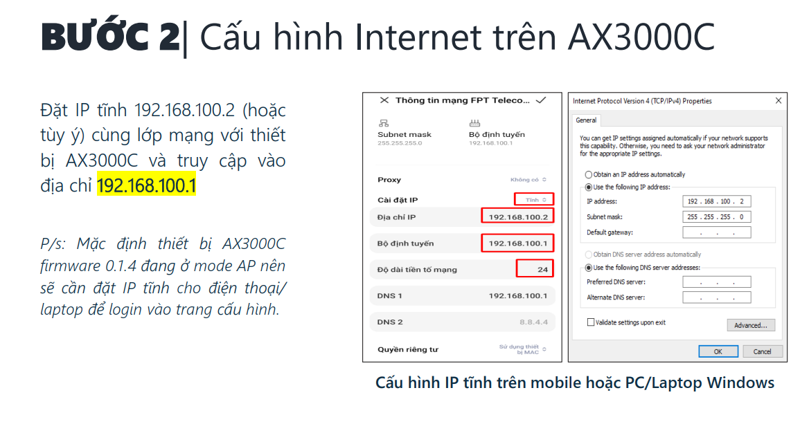
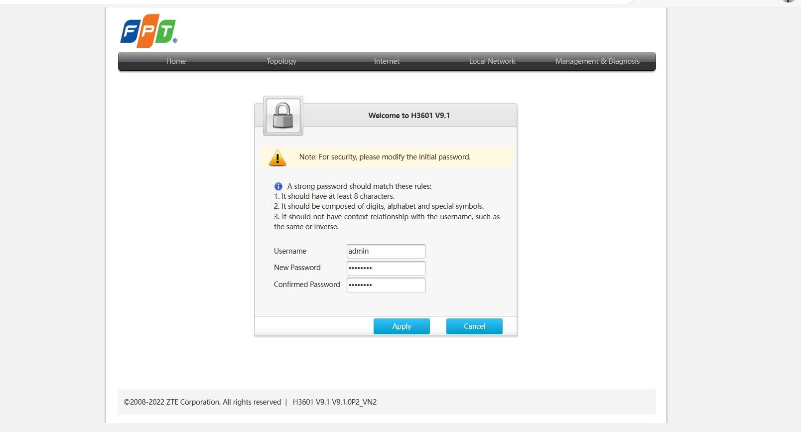

 

  
<h1>▶ ⭐Moderm(Nhấp vào đi anh)</h1>

  
<h2>AP AX3000C(Nhấp vào đi anh)</h2>

**Trước khi cấu hình thì update Firmware mới nhất cho AP**
- Link tải: 
	+  <a href="https://drive.google.com/file/d/1uSCAUmn9oYvDRcZJAFk4GAzpJvVn7j_j/view?usp=sharing" target="_blank">update Firmware mới nhất cho AP</a>.

<h3>Mô hình G97GR3-AP(Nhấp vào đi anh)</h3>

	

<h3>Mô hình G97CM – AX3000C(Nhấp vào đi anh)</h3>

**Chú ý:**

<h3>1 số lỗi AX3000C</h3>

	

  
<h2>AP AX1800AZ(Nhấp vào đi anh)</h2>

**Chú ý cấu hình IGMP( để mở luồng IPTV):**

- Logo: ZTE

- Logo: FPT

**Chú ý về G97GR3:**

	

  
<h2>AP AX1500C(Nhấp vào đi anh)</h2>

	

  
<h1>▶ ⭐1 số tools(Nhấp vào đi anh)</h1>

  
<h2>Network Analyzer</h2>

 

