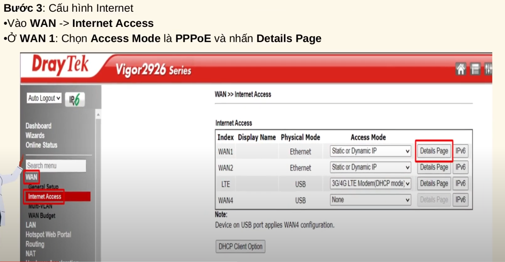
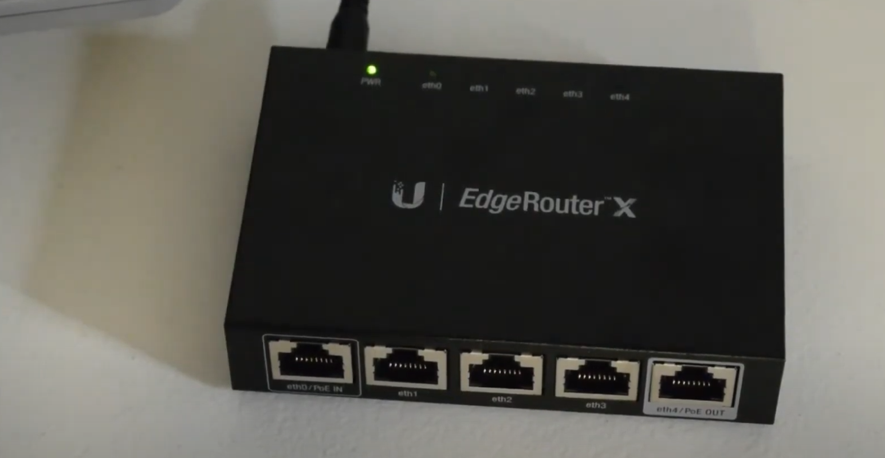
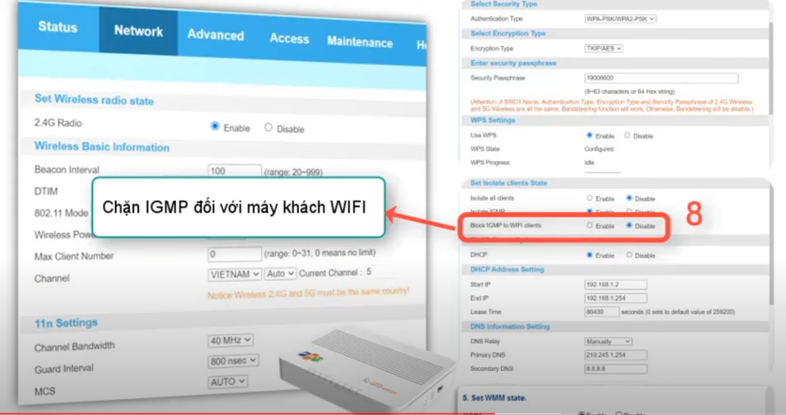

 
  

  
<h1>▶ ⭐1 số lỗi cơ bản trên modem/Box</h1>

  

  
<h2>Modem</h2>

- Trước khi check thì kiểm tra gói cước nhà khg
- Ứng với mỗi gói sẽ phù hợp từng mô hình

- Với mạng lag/chậm, chập chờn:
  + Kiểm tra vị trí khách hàng sử dụng:
    + Nếu đo sóng thấy xa thì care khg mua AP
  + Dịch vụ nào chậm:
    + Nếu kiểm tra modem ok , các dịch vụ khác ok .
    + Chỉ có quốc tế/ game /live stream lag thì gỡ Nat , care khg lên wifi 6 để phù hơp
    + Nếu nhiều thiết bị thì care nâng lên gói META
  + Gói cước / thiết bị có phù hợp với nhu cầu khách hàng hay không
    + Check cái này trong mục modem
  + Kiểm tra modem khg có lỗi hay không :
    + Đổi tên wifi /pass , rút hết dây lan của khg 
    + Lấy 1 điện thoại vào check ping `192.18.1.1` mà rớt gói hoặc ping lên mấy trăm 
    + thì đổi modem khác rồi đo lại
  + Với trường hợp mà khg dùng mạng chậm:
    + ping tới trang khách hàng dùng , ví dụ `youtube.com` mà rớt gói , ping cao
    + Báo SCC hỗ trợ
  

<h2>Box</h2>

 
 
 
 
 
 
 
 
 

  
<h1>▶ ⭐Tổng quan Moderm(Nhấp vào đi anh)</h1>

 

  
<h1>▶ ⭐Moderm(Nhấp vào đi anh)</h1>

  
<h2>AP AX3000C(Nhấp vào đi anh)</h2>

**Trước khi cấu hình thì update Firmware mới nhất cho AP**
- Link tải: 
	+  <a href="https://drive.google.com/file/d/1uSCAUmn9oYvDRcZJAFk4GAzpJvVn7j_j/view?usp=sharing" target="_blank">update Firmware mới nhất cho AP</a>.

<h3>Mô hình G97GR3-AP(Nhấp vào đi anh)</h3>

	

<h3>Mô hình G97CM – AX3000C(Nhấp vào đi anh)</h3>

**Chú ý:**

<h3>1 số lỗi AX3000C</h3>

	

  
<h2>AP AX1800AZ(Nhấp vào đi anh)</h2>

**Chú ý cấu hình IGMP( để mở luồng IPTV):**

- Logo: ZTE

- Logo: FPT

**Chú ý về G97GR3:**

	

  
<h2>AP AX1500C(Nhấp vào đi anh)</h2>

  
<h2>Vigor 2926>>300b/(Nhấp vào đi anh)</h2>

**Cấu hình load balance(quán nét)**

**Cấu hình IPTV**

**GIỚI HẠN BĂNG THÔNG CHO QUÁN NÉT**

- Thông thường để 30Mbps
- Chú ý set ip tĩnh cho máy , rồi mới bật chức năng giới hạn băng thông lên cho từng IP hoặc dãy IP cần giới hạn

  
<h2>EdgeRouter X (Nhấp vào đi anh)</h2>

- Laptop + pord 2 
- Nhớ đặt ip tĩnh;192.168.1.xxx

- Cấu hình xong tắt ip tĩnh
- Cấu hình load balancing:

- Tính năng này nghĩa là 1 line bị đứt thì Router sẽ chạy line còn lại( nghĩa là k load đc 2 line)
- Vào dashbord kiểm tra

- Cấu hình IPTV:

	

  
<h2>AC1000F</h2>

- 20 với 2.4
- 40 với 5.0

	

  
<h2> ARUBA INSTANT ON AP11</h2>

- Dây xanh từ modem 
- Dây trắng từ aruba

	

	

  
<h1>▶ ⭐1 số tools(Nhấp vào đi anh)</h1>

  
<h2>Network Analyzer</h2>

 

  
<h2>Wireshark</h2>

- Link tải: 
	+  <a href="https://drive.google.com/file/d/1MB_4SMiYgDr9RJzAJPVTkLy5sgnDNK7o/view?usp=sharing" target="_blank">update Firmware mới nhất cho AP</a>.

- Nhập lệnh : ip.addr == 192.168.xxx.xx

details>
  
<h2>VLC</h2>

- `udp://@225.1.2.247:30120`

